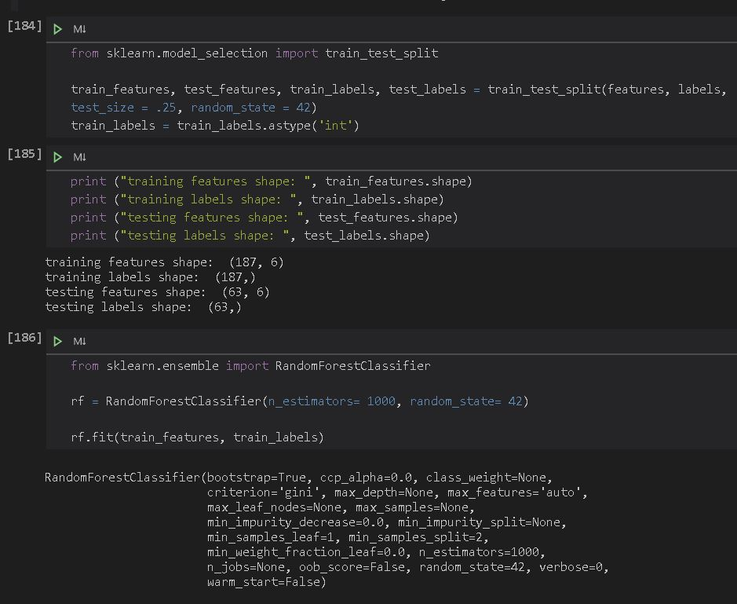
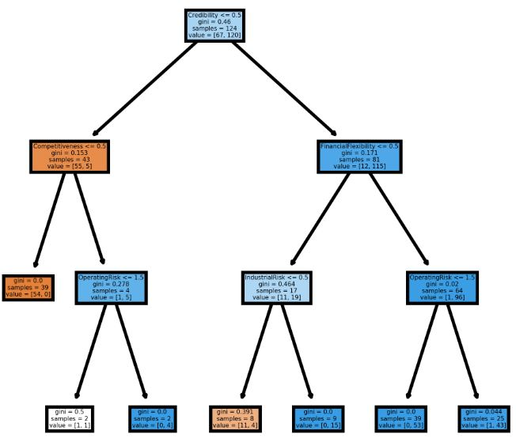
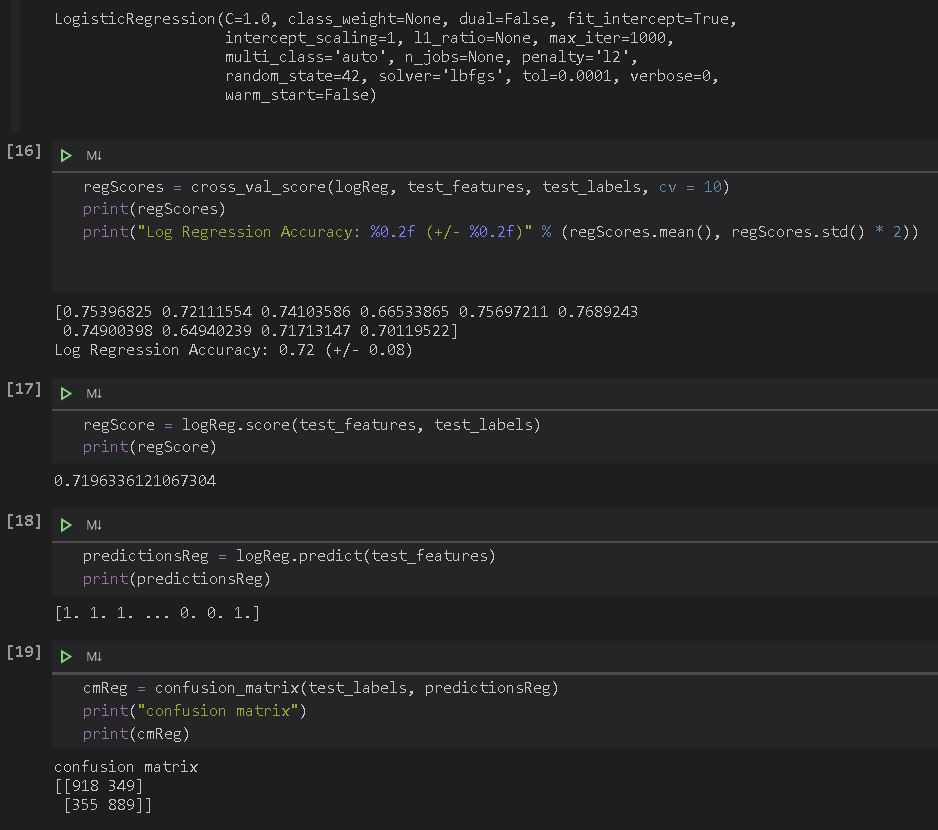
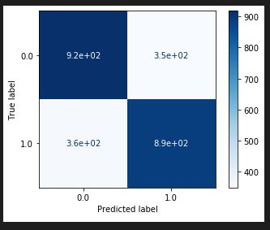
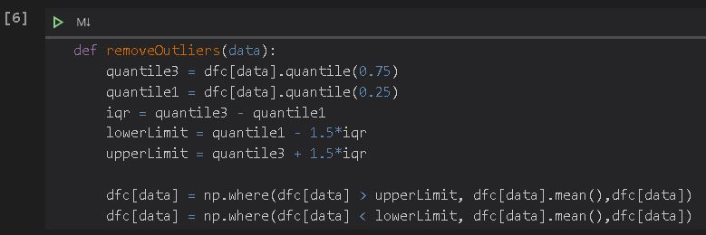
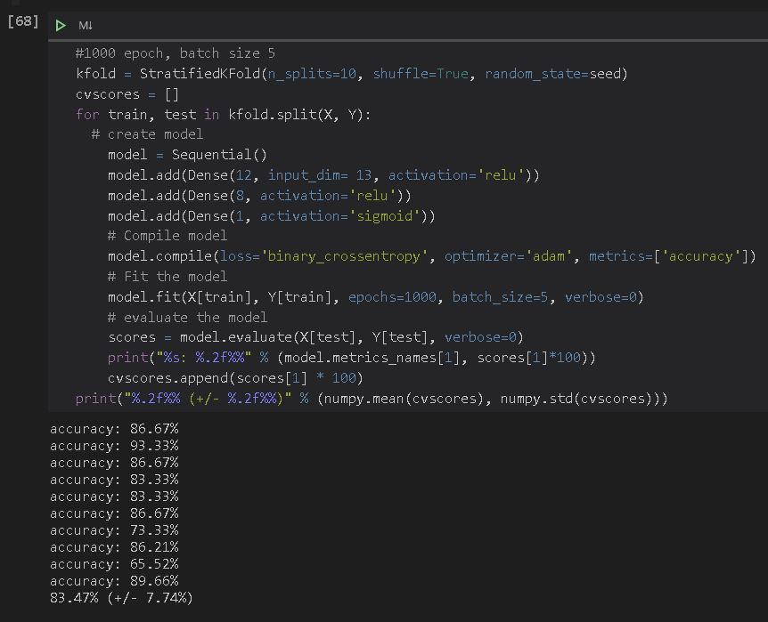
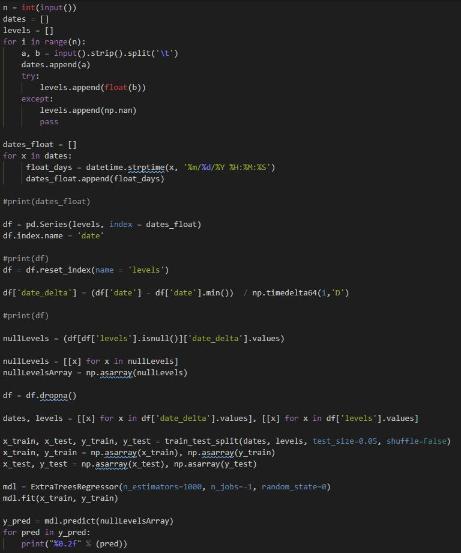

# Repository for machine learning projects
Welcome to my gitHub machine learning portfolio. Here you will find examples of several machine learning projects 

## Design Philosophy

My passion lies in following modern best practices while exploring and implementing cutting edge technologies

## Projects

These project were developed using python, jupyter notebooks, and a variety of machine learning technologies

### Analysis of chance of Bankruptcy 

This project uses key business metrics in order to determine the likelihood of a business declaring bankruptcy. In the notebook you will see how data must be altered so that it can be fed into a random forest classifier model and how the model is trained, evaluated, and made more efficient.

Random forest classifiers are powerful models that often produce very accurate results. They can also be used to create easy to read graphics that show the branches that the model creates in order to get to its results. This model is also very good at distilling out the key metrics that have the most impact on the outcome of the target variable. This allows analysts to spend less time collecting data to implement the model and just focus of the metrics that have the most impact. 

Below you will see the code that trains the model.

[BankruptcyProject Notebook](BankruptcyProject.ipynb)

Here is a graphic that shows the branches of the random forest that lead to the predictions. This is a model that only use the the key metrics determined from the model using all metrics. This simpler model produces results with the same accuracy of the larger model and highlights one of the major benefits of using the random forest.

### Analysis of the Marketing Campaign

This project uses data about customers at a bank. The data gathered was then used to build a model that determined the key traits that lead to the success of a marketing campaign and allow future campaigns to target customers that are most likely to purchase the product.

Below is an example of one of the models used in the project. This is a logarithmic regression model that is used for predicting binary targets.
 
During the Pre-processing phase the data set had several irrelevant traits removed that would lead to over fitting and have little impact on whether a customer would purchase the product. The data set was also imbalanced and heavily skewed towards data where the customer made a purchase. Positive purchase rows were dropped randomly to bring the number of positive and negative target variables in the data set to an even number. Imbalanced data sets are a key flaw in models that will lead to over fitting. 

Below you will see the metrics used to evaluate the accuracy of the logarithmic regression model.  

[MarketingProject Models Notebook](MarketingProjectModels.ipynb)

This is a graphic that shows the confusion matrix of a logarithmic regression model. Confusion matrixes show the false and true negative and positive predictions of the model. This is a useful metric to determine if the model suffers from over fitting due to an imbalanced data set or from variables included in the model that will skew the results. 

This notebook includes the steps used in the data-preprocessing phase of this project. The objective is to determine traits that are not relevant to the marketing campaign, remove outliers and data that would not be able to be fed into a ML model, balance the data set to avoid over fitting, and look for trends and correlations that would be useful in the analysis. The image shown is a short piece of code that will remove outliers from the data set using the interquartile range method. Identifying and removing outliers is an essential step to producing an accurate model. 

[MarketingProject Pre-processing Notebook](MarketingProjectPre-Precessing.ipynb)

### Cancer Diagnosis Project Using Neural Nets

This project uses neural nets to create models that can assist doctors in diagnosing patients with lung cancer. Neural Nets and can be very accurate and can effectively create models from large and complex data sets. The key to building good neural net models is determining the optimal layers, epochs, and batch sizes so that the model will run quickly and produce the most accurate results. The same steps were taken in the pre-processing phase as the marketing campaign project.

[Cancer Diagnosis with Neural Nets Notebook](CancerDiagnosisWithNeuralNet.ipynb)

### Missing value imputation on a times series dataset

This file will use an ExtraTreeRegressor model to impute missing values from a stock price data set. It is a relatively simple piece of code but it highlights a great method to convert a time series data set into a format that can be read my a machine learning model. 

[Missing stock value imputation script](missingStockImputation.py)

